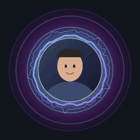
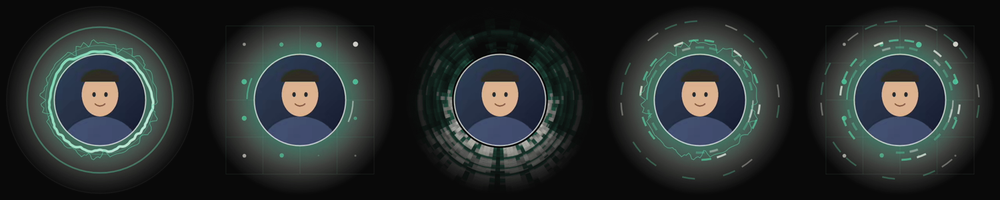

# Yapatar

<p align="center">
  
</p>

Turn a voice recording + an avatar image into a **transparent-background video** of the
avatar pulsing with the voice — glow, expanding rings on transients, a spectrum-deformed
outline and a waveform scope ring. Drop the file into DaVinci Resolve (or Premiere / FCP)
on a track above your screencast, scale it into a corner, done. No keying, no green screen.

## Quick start

```bash
npm install
node src/make-avatar.js                 # placeholder avatar (replace assets/avatar.png)
node src/render.js --audio assets/voice.wav --avatar assets/avatar.png
```

Produces:

| file | what |
|---|---|
| `out/avatar_alpha.mov` | ProRes 4444 w/ alpha, **silent** — this is the overlay |
| `out/preview.mp4` | flattened on a dark background + audio, just for eyeballing |

## Live preview (tune the look)

```bash
node src/serve.js                # serves the page AND persists your settings
open http://localhost:8777/preview.html
```

Chrome pauses the render loop for background tabs, so **bring the window to the front**
before pressing play — otherwise it looks frozen.

Press **🎬 Render the final file** and the page uploads your audio and avatar to the local
server, which shells out to the renderer and streams progress back; you get a download link
when it finishes. No terminal, and no need to know where your files live — the browser hands
over the bytes, not a path.

Press **💾 Save settings for the agent** and the current values land in `settings.json`,
which `render.js` picks up automatically (explicit CLI flags still win). Open the page with
query params to preconfigure it: `preview.html?hueA=200&glow=140`.

Sliders for hue, bounce, glow, blob amount and sensitivity, driven by a file **or your
microphone**. `src/visual.js` is shared by the preview and the renderer, so what you tune
is exactly what renders.

## Styles

```
--style pulse | constellation | waterfall | packets | handshake
```



Left to right, all shown in the `modem` palette:

- **pulse** — glow, rings on transients, spectrum-deformed outline, waveform ring. The default.
- **constellation** — a QAM constellation diagram, which is how a modem actually encodes
  bits onto a carrier: each symbol is a point in amplitude/phase space, and noise smears the
  cluster. Loud clean speech snaps the lattice tight; silence lets it drift.
- **waterfall** — a radial spectrogram. Each frame pushes the current spectrum outward, so
  the last ~1.5 s of your voice trails away from the avatar. The one that most obviously
  reads as *that is my sound*.
- **packets** — transients emit framed bursts of dashes travelling outward, each burst with
  its own bit pattern, like data on the wire.
- **handshake** — a carrier arc that sweeps while searching and locks when you speak,
  combined with symbols and packets.

### Palettes

```
--preset modem            # modem.dev teal #44BDA3 + cream #F8F8ED
--colorA '#44BDA3' --colorB '#F8F8ED'
--hueA 190 --hueB 285     # or drive it by hue
```

## Options

```
--audio    path    audio (or video) file to react to      default assets/voice.wav
--avatar   path    image, centre-cropped into the circle  default assets/avatar.png
--outdir   path    output directory                       default out
--fps      n       frame rate — match your timeline       default 30
--size     n       square output in px                    default 512
--codec    c       prores | hevc | png                    default prores
--gain     n       multiply reactivity                    default 1
--range    n       dB range: lower = more per-syllable     default 13
--hueA/--hueB n    gradient hues 0-360                    default 190 / 285
--bounce   n       avatar scale with loudness, 0-30        default 9
--glow     n       glow intensity, 0-200                   default 100
--blob     n       spectrum deformation, 0-30              default 9
--no-preview       skip the flattened mp4

Every one of these matches a slider in `preview.html`, which prints the exact command
for your current settings with a copy button — tune visually, paste, render.
```

### Alpha: premultiplied vs straight

```
--alpha premultiplied   # default
--alpha straight
```

Canvas2D produces **straight** alpha, but Resolve (and most NLEs) composite as
**premultiplied** by default. Handing straight data to a premultiplied compositor *adds* the
full-brightness colour instead of scaling it, so soft glows blow out to a solid white blob
around the avatar. Yapatar therefore premultiplies on the way out by default, which is what
your NLE expects.

If you already have a render that shows a white halo, you don't have to re-render: in
Resolve, right-click the clip -> **Clip Attributes -> Alpha Mode -> Straight**. Use
`--alpha straight` if you specifically want that workflow.

### Codec choice

Measured on 18.9 s @ 512×512 / 30 fps:

| `--codec` | size | notes |
|---|---|---|
| `prores` | 286 MB | ProRes 4444, 16-bit alpha. Safest, works everywhere. |
| `hevc` | 14 MB | Apple HEVC w/ alpha. **~20× smaller**, 8-bit alpha, 4:2:0 colour. macOS NLEs read it fine. |
| `png` | 112 MB | Lossless RGBA in a .mov. Slow to decode. |

ProRes is roughly 15 MB/s of runtime, so a 30-minute take is ~27 GB — use `--codec hevc`
for anything long, or render at the size the overlay actually appears at.

## Long recordings

Measured on this machine, 512x512 @ 30 fps, a real 30-minute (1815 s) file:

| | render time | output size | peak RAM |
|---|---|---|---|
| `--codec hevc` | 91 s | **1.3 GB** | 1.2 GB |
| `--codec prores` | ~100 s | **~27 GB** | 1.2 GB |

Render time is fine either way — about 20x faster than realtime. **Size is the thing that
bites:** ProRes 4444 is a fixed ~15 MB per second of runtime regardless of content, so a
half-hour take is 27 GB. Use `--codec hevc` for anything long; it's the same picture with
8-bit alpha instead of 16-bit, which no one will see in a corner overlay.

RAM is ~1.2 GB at 30 minutes because the whole decoded PCM plus per-frame features are held
at once. That's comfortable, but it grows linearly — a multi-hour file would need chunking.

## Workflow

1. Record voice + screen as usual.
2. Extract or point at the voice track: `--audio take01.wav` (a video file works too —
   ffmpeg pulls the audio out).
3. Render at your timeline's fps: `--fps 30`.
4. In Resolve: import `avatar_alpha.mov`, drop it on video track 2 above the screencast.
   Alpha is honoured automatically — no need to set a composite mode. Scale/position into
   a corner. The clip is silent; keep using your original audio track.
5. Because the render is frame-locked to the audio file, it stays in sync as long as the
   overlay starts at the same timecode as that audio.

### The server

`src/serve.js` also exposes the render pipeline over HTTP:

| | |
|---|---|
| `POST /upload?name=x.wav` | raw body, returns `{id}` |
| `POST /render` | `{audioId, avatarId, style, preset, codec, ...}` -> `{jobId}` |
| `GET /job/:id` | `{state, pct, output, error}` |
| `GET/POST /settings` | the tuned values |

It spawns subprocesses, so it is deliberately locked down: bound to `127.0.0.1` only,
requests carrying a foreign `Origin` are rejected, and nothing reaches a shell — `render.js`
is spawned with an argv array, `style`/`preset`/`codec` are checked against allowlists, and
every numeric field is coerced and clamped. Uploads land in `.uploads/` and rendered jobs in
`out/web/<jobId>/`; both are gitignored and safe to delete.

## Using it from Claude Code

This project doubles as a plugin. `skills/yapatar/SKILL.md` teaches an agent the
whole loop: start the server, open a preconfigured preview, wait for you to tune and save,
then render with your values. It's symlinked into `~/.claude/skills/`, so it's live now —
just ask for a voice-reactive avatar overlay.

To share it, `.claude-plugin/plugin.json` makes the repo installable as a plugin.

## Licence

MIT.

## How it works

- `src/audio.js` — ffmpeg decodes to mono f32 PCM; per video frame a 2048-sample Hann
  window gives RMS loudness and a 64-bin log-spaced spectrum (60 Hz–8 kHz). Loudness is
  **auto-calibrated per clip**: the 97th percentile becomes "full pulse", 13 dB below it
  becomes rest. Without that, ordinary speech pins the visual at maximum and nothing
  appears to react. Then fast-attack / slow-release smoothing, so it moves like speech.
- `src/visual.js` — pure Canvas2D, no DOM, so the identical code runs in the browser
  preview and headless in Node via `@napi-rs/canvas`. Deterministic: driven by frame
  index, never by wall-clock, so renders are reproducible.
- `src/render.js` — pipes raw RGBA frames straight into ffmpeg's stdin. ~10× faster than
  realtime (18.9 s of audio renders in 2 s).

The layout keeps a deliberate margin: glow and expanding rings are sized so they never
touch the frame edge, which would show as a hard clipped square once composited.
